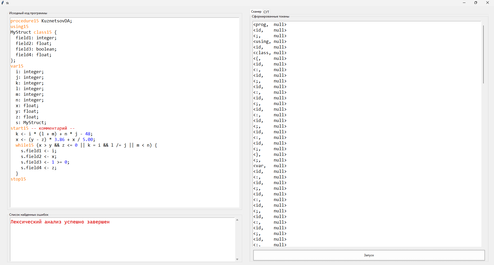

# Теория языков программирования

## Вариант 15

### Пример программы

```pascal
procedure15 KuznetsovDA;
using15
MyStruct class15 {
  field1: integer;
  field2: float;
  field3: boolean;
  field4: float;
};
var15
  i: integer;
  j: integer;
  k: integer;
  l: integer;
  m: integer;
  n: integer;
  x: float;
  y: float;
  z: float;
  s: MyStruct;
start15 -- комментарий --
  k <- i * (l + m) + n * j - 48;
  x <- (y - z) * 3.86 + x / 5.00;
  while15 (x > y && z <= 0 || k = i && l /= j || m < n) {
    s.field1 <- i;
    s.field2 <- x;
    s.field3 <- 1 >= 0;
    s.field4 <- z;
  }
stop15
```

### Интерфейс приложения

